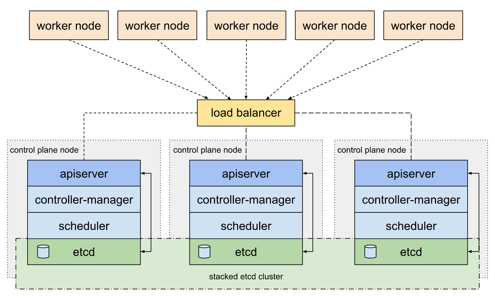
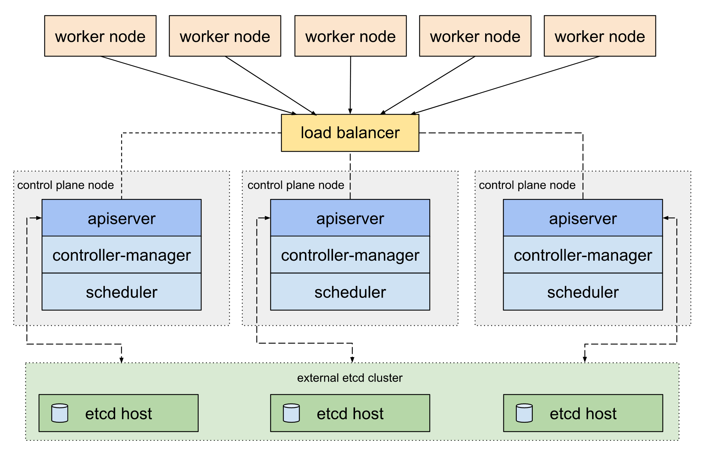

# HA in K8S

## Stacked etcd topology (default in kubeadm)
- ```etcd``` runs on the same nodes as the rest of the control plane components and communicates only with ```kube-apiserver``` running on the same node
- local ```etcd``` member is created automatically on control plane nodes when using ```kubeadm init``` and ```kubeadm join --control-plane```
- each control plane node runs an instance of the ```kube-apiserver```, ```kube-scheduler```, and ```kube-controller-manager```
- ```kube-apiserver``` is exposed to worker nodes using a ```load balancer```



## External etcd topology 
- decouples the control plane and ```etcd``` member
- ```etcd``` runs on separate nodes and each ```etcd``` host communicates with the ```kube-apiserver``` of each control plane node
- each control plane node runs an instance of the ```kube-apiserver```, ```kube-scheduler```, and ```kube-controller-manager```


